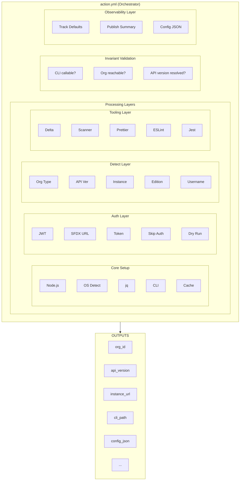
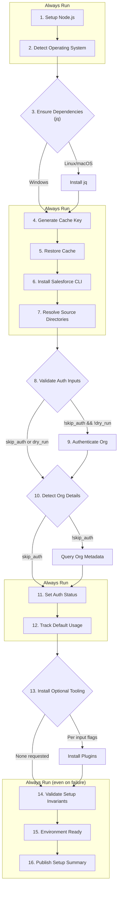

# Architecture Documentation

> This document captures the architectural design, philosophy, and future roadmap for `setup-salesforce-action`. It serves as a reference for maintainers and contributors, and as a blueprint for future modularization.

---

## Table of Contents

1. [Design Philosophy](#design-philosophy)
2. [Current Architecture (v3)](#current-architecture-v3)
3. [Interface Contract](#interface-contract)
4. [Error Modes](#error-modes)
5. [Security Model](#security-model)
6. [Performance Characteristics](#performance-characteristics)
7. [Future Architecture (v4)](#future-architecture-v4)
8. [The Polyglot Pattern](#the-polyglot-pattern)
9. [Release Strategy](#release-strategy)
10. [Testing Approach](#testing-approach)
11. [For Contributors](#for-contributors)
12. [Known Limitations](#known-limitations)
13. [Frequently Asked Questions](#frequently-asked-questions)
14. [Glossary](#glossary)
15. [Decision Log](#decision-log)

---

## Design Philosophy

### This Action is a System API

In enterprise integration architecture (e.g., MuleSoft), a **System API** is a foundational layer that:

- Provides stable, well-documented interfaces
- Hides implementation complexity from consumers
- Changes rarely and only with major version bumps
- Is consumed by higher-level "Process" and "Experience" APIs

This action follows the same pattern. It is **not** an application—it is a **primitive** that other workflows depend on.

### Core Principles

| Principle                  | Description                                                                                                                                |
| -------------------------- | ------------------------------------------------------------------------------------------------------------------------------------------ |
| **Fail Fast**              | Never report success when invariants are violated. Partial failures are more dangerous than full failures.                                 |
| **Contract-First**         | Outputs and environment variables are stable interfaces. Breaking changes require major version bumps.                                     |
| **Zero Policy**            | Detection informs, but does not decide. The action reports org type, API version, etc., but never implements "if sandbox then do X" logic. |
| **Composability**          | The action does one thing well: provision a validated Salesforce execution environment. Everything else is the consumer's responsibility.  |
| **Backward Compatibility** | Defaults never change in minor versions. New features are additive.                                                                        |

### Why Composite Actions (Not TypeScript)

This action is implemented as a **Composite Action** (YAML + shell scripts) rather than a **JavaScript Action** (TypeScript). This is intentional.

| Aspect                     | Composite Action  | JavaScript Action             |
| -------------------------- | ----------------- | ----------------------------- |
| **Primary Use Case**       | CLI orchestration | Complex logic, API calls      |
| **Build Step Required**    | No                | Yes (`npm run build`)         |
| **Dependencies**           | Shell utilities   | Node.js runtime               |
| **Contributor Friction**   | Low (YAML + bash) | Higher (TypeScript knowledge) |
| **Release Process**        | Tag and go        | Build → Commit dist → Tag     |
| **Right for This Action?** | ✅ Yes            | ❌ Overkill                   |

**What this action actually does:**

```
1. npm install @salesforce/cli          → Shell command
2. sf org login jwt                      → Shell command
3. sf plugins install sfdx-git-delta    → Shell command
4. sf org display --json | jq            → Shell command + parsing
5. Check exit codes, set outputs        → Shell logic
```

This is **CLI orchestration**—exactly what Composite Actions are designed for.

---

## Current Architecture (v3)

### High-Level Structure



### Component Responsibilities

#### Core Setup

- **Node.js Installation**: Uses `actions/setup-node@v4`
- **OS Detection**: Determines Linux/macOS/Windows for platform-specific logic
- **Dependency Management**: Installs `jq` via apt/brew/choco
- **CLI Installation**: Installs `@salesforce/cli` with retry logic
- **Caching**: OS-specific cache paths with intelligent key generation

#### Auth Layer

- **JWT Authentication**: Enterprise production pattern
- **SFDX Auth URL**: Sandbox and quick setup pattern
- **Access Token**: Advanced integrations
- **Skip Auth Mode**: CLI-only installations
- **Dry Run Mode**: Testing without mutations

#### Detect Layer

- **Org Display**: Queries authenticated org metadata
- **Type Detection**: Production vs Sandbox vs Scratch
- **API Version Resolution**: Auto-detects from org
- **Instance URL Extraction**: Resolves org endpoint

#### Tooling Layer (Optional)

- **sfdx-git-delta**: Delta deployments
- **Code Analyzer**: PMD, ESLint, RetireJS scanning
- **Prettier**: Apex code formatting
- **ESLint**: LWC linting
- **sfdx-lwc-jest**: LWC testing
- **Custom Plugins**: User-specified plugins

#### Invariant Validation

- **CLI Functional Check**: `sf version --json` succeeds
- **Org Reachable Check**: `sf org display --json` succeeds
- **API Version Check**: Version is resolved (not "unknown")
- **Fail Fast**: Exits with clear violation message on failure

#### Observability Layer

- **Default Tracking**: Flags when implicit defaults are used
- **Summary Publication**: Writes to `$GITHUB_STEP_SUMMARY`
- **Config JSON**: Structured audit record of effective configuration

### Step Execution Flow



---

## Interface Contract

### Environment Variables (Internal)

These are set by the action for internal use and potential external tooling:

| Variable                         | Description                     | Set By              |
| -------------------------------- | ------------------------------- | ------------------- |
| `SF_CLI_DISABLE_AUTOUPDATE`      | Prevents CLI from self-updating | Cache step          |
| `SFDX_USE_GENERIC_UNIX_KEYCHAIN` | Enables keychain on Linux       | Auth step           |
| `SFDX_LOG_LEVEL`                 | Controls CLI verbosity          | Debug mode (future) |

### Outputs (Public Contract)

These outputs are **stable interfaces**. Changes require major version bumps.

#### Core Outputs

| Output           | Type    | Description                           |
| ---------------- | ------- | ------------------------------------- |
| `org_id`         | string  | Authenticated Salesforce Org ID       |
| `org_type`       | string  | Production, Sandbox, or Scratch       |
| `org_edition`    | string  | Enterprise, Developer, etc.           |
| `username`       | string  | Authenticated username                |
| `instance_url`   | string  | Org instance URL                      |
| `api_version`    | string  | Resolved Salesforce API version       |
| `auth_performed` | boolean | Whether authentication was performed  |
| `sf_cli_version` | string  | Installed CLI version string          |
| `source_flags`   | string  | Resolved `--source-dir` flags for CLI |

#### Default Tracking Outputs

| Output                     | Type    | Description                          |
| -------------------------- | ------- | ------------------------------------ |
| `used_default_node`        | boolean | True if default Node.js version used |
| `used_default_cli_version` | boolean | True if default CLI version used     |
| `used_default_api_version` | boolean | True if API version auto-detected    |

#### Forward Compatibility Outputs (v4 Prep)

| Output             | Type        | Description                                   |
| ------------------ | ----------- | --------------------------------------------- |
| `cli_binary_path`  | string      | Absolute path to `sf` executable              |
| `validated_config` | JSON string | Structured summary of effective configuration |

### Guaranteed Invariants

On successful completion, the action **guarantees**:

1. ✅ `sf` command is installed and callable
2. ✅ Authenticated org is reachable (unless `skip_auth: true`)
3. ✅ Instance URL is resolved
4. ✅ API version is determined
5. ✅ No secrets appear in logs

If any invariant fails, the action **fails fast** with a clear `INVARIANT VIOLATION` message.

---

## Error Modes

Understanding how the action fails helps diagnose issues and design recovery strategies.

### Recoverable Errors

These errors trigger automatic retry logic:

| Error                                   | Retry Strategy                     | Max Attempts |
| --------------------------------------- | ---------------------------------- | ------------ |
| Network timeout during CLI installation | Exponential backoff (5s, 10s, 20s) | 3            |
| npm registry unavailability             | Exponential backoff                | 3            |
| Transient org connection failures       | No retry (fail fast)               | 1            |

### Non-Recoverable Errors

These errors fail immediately with clear messages:

| Error                      | Cause                                     | Resolution                                    |
| -------------------------- | ----------------------------------------- | --------------------------------------------- |
| Invalid JWT key            | Malformed PEM, wrong encoding             | Regenerate certificate, check base64 encoding |
| Org unreachable after auth | Network restrictions, invalid credentials | Verify firewall rules, check Connected App    |
| CLI binary corrupted       | Cache corruption, incomplete download     | Clear cache, retry workflow                   |
| Invariant violation        | CLI non-functional, org inaccessible      | Check logs for specific failure               |

### User-Controlled Failures

These errors respect the `strict` input:

| Scenario                   | `strict: false` (default) | `strict: true`    |
| -------------------------- | ------------------------- | ----------------- |
| Plugin installation fails  | Warns, continues          | Fails immediately |
| Scanner installation fails | Warns, continues          | Fails immediately |
| Optional tool unavailable  | Warns, continues          | Fails immediately |

**Philosophy**: Core functionality (CLI, auth) always fails fast. Optional tooling respects user preference.

---

## Security Model

### Secrets Handling

| Credential Type | Storage Method                                    | Cleanup                   |
| --------------- | ------------------------------------------------- | ------------------------- |
| JWT Private Key | Temporary file with `chmod 600` (Linux/macOS)     | Deleted in cleanup step   |
| Access Token    | Environment variable only (never written to disk) | Cleared by GitHub Actions |
| SFDX Auth URL   | Temporary file with restricted permissions        | Deleted in cleanup step   |

**Windows Note**: File permissions are not enforced on Windows due to platform limitations. Secrets are still cleaned up but rely on GitHub Actions OS-level isolation.

### Credential Lifetime

| Auth Method   | Typical Lifetime                  | Managed By                 |
| ------------- | --------------------------------- | -------------------------- |
| JWT           | 3-5 minutes (ephemeral)           | Generated per workflow run |
| Access Token  | User-defined (typically 24 hours) | User/Salesforce admin      |
| SFDX Auth URL | 24 hours (default)                | Salesforce CLI             |

### Audit Trail

- **`validated_config` output**: JSON summary of effective configuration (no secrets)
- **Step Summary**: Published to `$GITHUB_STEP_SUMMARY` for compliance visibility
- **GitHub Actions logs**: Secrets automatically redacted by GitHub (pattern: `***`)

### Security Best Practices

1. **Never log secrets**: Use `core.setSecret()` pattern (GitHub Actions handles this automatically for secrets)
2. **Cleanup temporary files**: Even on failure, cleanup runs via `if: always()`
3. **Minimal credential scope**: Request only necessary OAuth scopes
4. **Rotate credentials regularly**: Especially for production orgs

---

## Performance Characteristics

### Typical Timings (Ubuntu, cache miss)

| Phase                      | Duration            | Notes                           |
| -------------------------- | ------------------- | ------------------------------- |
| Node.js setup              | 5-10 seconds        | Cached by `actions/setup-node`  |
| CLI installation           | 90-120 seconds      | npm download + install          |
| JWT authentication         | 10-20 seconds       | Includes certificate validation |
| Plugin installation (each) | 5-15 seconds        | Depends on plugin size          |
| Org detection              | 2-5 seconds         | API call latency                |
| **Total (no plugins)**     | **110-160 seconds** | First run                       |

### Cache Hit Scenarios

| Cache State                        | Duration        | Speedup     |
| ---------------------------------- | --------------- | ----------- |
| **Full cache hit** (CLI + plugins) | 10-20 seconds   | ~85% faster |
| **Partial hit** (CLI only)         | 20-30 seconds   | ~75% faster |
| **Cache miss**                     | 120-180 seconds | Baseline    |

### Platform Variations

| Platform                     | Performance | Notes                                          |
| ---------------------------- | ----------- | ---------------------------------------------- |
| **Linux** (ubuntu-latest)    | Baseline    | Fastest due to native package management       |
| **macOS** (macos-latest)     | +10-20%     | Homebrew overhead for dependencies             |
| **Windows** (windows-latest) | +30-40%     | Chocolatey + npm overhead                      |
| **Self-hosted**              | Variable    | Depends on network proximity to npm/Salesforce |

### Optimization Strategies

1. **Use explicit versions**: `cli_version: "2.30.8"` for consistent cache hits
2. **Minimize plugins**: Only install what you need
3. **Use cache warming**: Pre-populate cache in dedicated workflow
4. **Consider self-hosted runners**: Reduce npm download latency

### Performance Monitoring

Track these metrics in your workflows:

```yaml
- name: Measure Setup Time
  run: |
    echo "Setup completed in ${{ steps.setup.duration }} seconds"
    echo "Cache hit: ${{ steps.cache.outputs.cache-hit }}"
```

---

## Future Architecture (v4)

### v4 Triggers

v4 will be released when the modular architecture:

1. **Passes all existing tests** - The refactored modular structure must pass the exact same test cases as the current monolithic v3 action. The `action.yml` will serve as an orchestration wrapper that calls modular components, and existing test workflows will validate the integrated behavior
2. **Maintains performance parity** - No regression in setup time (cache hit and cache miss scenarios)
3. **Has a documented migration path** - Clear upgrade guide for any breaking changes

### v4 Breaking Changes (Potential)

The following changes **may** occur in v4:

| Change                                | Rationale               | Migration Path                    |
| ------------------------------------- | ----------------------- | --------------------------------- |
| Removal of deprecated `sfdx_*` inputs | CLI v1 is EOL           | Use `sf` equivalents              |
| Output format changes                 | Structured JSON outputs | Parse new format via `fromJSON()` |
| New required inputs (with defaults)   | Enhanced configuration  | Accept defaults or provide values |

**Commitment**: No silent behavior changes. Breaking changes will have clear migration documentation.

---

## The Polyglot Pattern

### Pattern Comparison

| Approach                          | Pros                                          | Cons                                                 | When to Use                                   |
| --------------------------------- | --------------------------------------------- | ---------------------------------------------------- | --------------------------------------------- |
| **Pure Composite**                | No build step, fast iteration, low barrier    | Complex JSON parsing in bash, limited error handling | CLI orchestration (current)                   |
| **Hybrid** (Composite + TS utils) | TypeScript for complex logic, no full rewrite | Requires build step for utilities                    | Project analysis, complex parsing             |
| **Full TypeScript**               | Best testing, type safety, rich ecosystem     | Higher contributor barrier, build overhead           | If action evolves into complex business logic |

**Current v3 Decision**: Pure Composite
**v4 Consideration**: Hybrid for Project Context Engine only
**Future**: Evaluate based on complexity growth

---

## Release Strategy

### Versioning Scheme

| Version            | Purpose                                | Stability                         | Example                       |
| ------------------ | -------------------------------------- | --------------------------------- | ----------------------------- |
| **MAJOR** (v3.x.x) | Breaking changes, architectural shifts | Production-ready after `.0` patch | v3.0.0 (invariant validation) |
| **MINOR** (v3.1.x) | New features, additive changes         | Immediate production use          | v3.1.0 (new optional input)   |
| **PATCH** (v3.1.1) | Bug fixes, documentation               | Immediate production use          | v3.1.1 (fix auth timeout)     |

### Release Cadence

| Type      | Frequency                   | Trigger                                     |
| --------- | --------------------------- | ------------------------------------------- |
| **Patch** | As needed                   | Critical bugs, security fixes               |
| **Minor** | Monthly (if features ready) | New optional features, quality improvements |
| **Major** | Every 6-12 months           | Breaking changes, architectural rewrite     |

### Tagging Strategy

```bash
# Create release
git tag -a v3.1.0 -m "feat: add custom alias support"
git push origin v3.1.0

# Update major version pointer (force)
git tag -fa v3 -m "Update v3 to latest v3.1.0"
git push origin v3 --force
```

**User Impact**: Users pinned to `@v3` automatically get v3.1.0. Users pinned to `@v3.0.0` stay on exact version.

### Backward Compatibility Promise

| Element      | Commitment                                          |
| ------------ | --------------------------------------------------- |
| **Inputs**   | Never removed, only deprecated with 6-month warning |
| **Outputs**  | Maintained for 1 major version after deprecation    |
| **Defaults** | Never change in PATCH or MINOR releases             |
| **Behavior** | Additive only in MINOR releases                     |

### Deprecation Process

1. **v3.1.0**: Add deprecation warning to logs
2. **v3.2.0** onward: Continue warning for 6 months
3. **v4.0.0**: Remove deprecated feature, update migration guide

Example warning:

```
⚠️  DEPRECATION WARNING: Input 'sfdx_version' is deprecated and will be removed in v4.0.0.
   Use 'cli_version' instead. See: https://github.com/rdbumstead/setup-salesforce-action/blob/main/docs/MIGRATION.md
```

---

## Testing Approach

### Test Matrix

```yaml
strategy:
  matrix:
    os: [ubuntu-latest, macos-latest, windows-latest]
    node: [18, 20]
    cli: [latest, 2.30.8]
    auth: [jwt, sfdx-url, access-token, skip]
```

**Coverage**: 3 OS × 2 Node × 2 CLI × 4 Auth = 48 combinations

**Optimized**: Critical paths tested across all OSes, edge cases on Ubuntu only.

### Unit Testing (Future)

When TypeScript utilities are introduced:

```typescript
// tests/analyze-project.test.ts
import { analyzeProject } from "../scripts/src/analyze-project";

describe("Project Analysis", () => {
  it("detects multi-package projects", () => {
    const result = analyzeProject("./fixtures/multi-pkg");
    expect(result.strategy).toBe("multi-package");
  });
});
```

**Tools**: Jest with `@actions/core` mocks

### Integration Testing

Current workflows test:

| Workflow                  | Tests                         |
| ------------------------- | ----------------------------- |
| `test-auth.yml`           | All auth methods across OSes  |
| `test-plugins.yml`        | Optional tooling installation |
| `test-invariants.yml`     | Validation, dry-run, defaults |
| `test-cross-platform.yml` | OS-specific edge cases        |

### Error Scenario Testing

```yaml
- name: Test Invariant Detection
  id: test-fail
  continue-on-error: true
  uses: ./
  with:
    jwt_key: ${{ secrets.INVALID_KEY }} # Expect failure

- name: Verify Failure
  if: steps.test-fail.outcome != 'failure'
  run: exit 1 # Test should have failed!
```

### Release Validation

Before major releases, validate by running all test workflows against the release candidate branch to ensure no regressions

---

## For Contributors

### Development Workflow

1. **Fork & Clone**

   ```bash
   gh repo fork rdbumstead/setup-salesforce-action --clone
   cd setup-salesforce-action
   ```

2. **Make Changes**
   - Edit `action.yml` for core logic
   - Edit `scripts/src/*.ts` for utilities (if applicable)
   - Update tests in `.github/workflows/test-*.yml`

3. **Build (if TypeScript changes)**

   ```bash
   npm install
   npm run build  # Generates dist/index.js
   ```

4. **Test Locally**

   ```bash
   # Use act for local testing
   act -j test-dry-run
   ```

5. **Submit PR**
   - Include updated `dist/` files (if applicable)
   - Reference issue number
   - Update `CHANGELOG.md` under `[Unreleased]`

### Module Authoring Guidelines (v4)

When the time comes to write modules:

| Guideline                 | Description                                       |
| ------------------------- | ------------------------------------------------- |
| **Single Responsibility** | Each module does one thing well                   |
| **Input Validation**      | Fail fast with clear error messages               |
| **Output Format**         | JSON for machine consumption, human-readable logs |
| **Documentation**         | README in module directory with examples          |
| **Testing**               | Standalone test workflow per module               |

### Code Style

- **Shell**: Follow [Google Shell Style Guide](https://google.github.io/styleguide/shellguide.html)
- **TypeScript**: Follow [Airbnb Style Guide](https://github.com/airbnb/javascript)
- **YAML**: 2-space indentation, anchor references for DRY

### Commit Convention

```
<type>(<scope>): <subject>

feat(auth): add SAML support
fix(cache): resolve Windows path issue
docs(readme): clarify JWT setup
```

Types: `feat`, `fix`, `docs`, `test`, `refactor`, `chore`

---

## Known Limitations

### Platform-Specific

| Platform    | Limitation                             | Workaround                                               |
| ----------- | -------------------------------------- | -------------------------------------------------------- |
| **Windows** | JWT file permissions not enforced      | Rely on GitHub Actions OS isolation                      |
| **macOS**   | Keychain configuration may be required | Set `SFDX_USE_GENERIC_UNIX_KEYCHAIN=true` (already done) |
| **Linux**   | Requires `jq` installation             | Automatically handled by action                          |

### Salesforce CLI Limitations

| Limitation                                          | Impact                                                             | Mitigation                                    |
| --------------------------------------------------- | ------------------------------------------------------------------ | --------------------------------------------- |
| Cannot install multiple CLI versions simultaneously | No parallel matrix testing with different CLI versions in same job | Use separate jobs                             |
| Plugin conflicts possible                           | User-installed plugins may conflict with each other                | Document known conflicts                      |
| Network proxy support varies                        | Corporate proxies may block npm/Salesforce                         | Configure `.npmrc` or use self-hosted runners |

### GitHub Actions Limitations

| Limitation                                 | Impact                               | Mitigation                             |
| ------------------------------------------ | ------------------------------------ | -------------------------------------- |
| Cache size limits (10GB per repo)          | Large plugin sets may exceed limit   | Use selective caching                  |
| Network timeouts in corporate environments | npm/Salesforce API calls may timeout | Increase timeout via `timeout-minutes` |
| Secret size limits                         | Large JWT keys may exceed limits     | Use Auth URL method instead            |

### Action-Specific

| Limitation                                 | Reason                     | Future Plan                      |
| ------------------------------------------ | -------------------------- | -------------------------------- |
| No multi-org authentication in single step | Architectural simplicity   | v4 may support via modules       |
| API version always auto-detected           | Salesforce CLI behavior    | v5 may add override input        |
| No support for proxy configuration         | Out of scope for primitive | Document user-side configuration |

---

## Frequently Asked Questions

### Q: Why doesn't the action support [specific Salesforce feature]?

**A**: This is a foundational primitive that provisions a validated Salesforce execution environment. Feature-specific actions (e.g., deployment strategies, test execution, package creation) should be built **on top** of this action, not **inside** it. This separation of concerns keeps the primitive stable and composable.

### Q: Can I use this with self-signed certificates?

**A**: Not directly. The action relies on Node.js and the Salesforce CLI, both of which require valid SSL certificates. If you must use self-signed certificates:

1. Add a pre-step to configure Node.js certificate store:
   ```yaml
   - run: npm config set cafile /path/to/cert.pem
   ```
2. Set `NODE_EXTRA_CA_CERTS` environment variable
3. Use self-hosted runners with pre-configured trust stores

### Q: Why is Windows support different from Linux/macOS?

**A**: Platform limitations in Salesforce CLI, npm, and Windows file system behavior require OS-specific workarounds:

- File permissions are advisory on Windows
- Chocolatey has different installation patterns than apt/brew
- Path separators and environment variables differ

We document these differences and test across all platforms to ensure consistent outcomes.

### Q: How do I debug authentication failures?

**A**: Enable debug logging and check specific failure points:

```yaml
- uses: rdbumstead/setup-salesforce-action@v3
  with:
    auth_method: jwt
    jwt_key: ${{ secrets.JWT_KEY }}
    debug: true # Enables verbose output
```

Common issues:

- **JWT**: Check certificate formatting, Consumer Key, username
- **Auth URL**: Verify URL is complete and not expired
- **Access Token**: Confirm token has not expired, org is reachable

### Q: Can I cache across different workflows?

**A**: Yes! GitHub Actions cache is repository-scoped. If two workflows use the same cache key, they share the cache. Design your cache keys carefully:

```yaml
key: sf-v3-${{ runner.os }}-node20-cli-latest-tools${{ hashFiles('plugins.txt') }}
```

### Q: What's the fastest way to run the action?

**A**:

1. Use explicit versions for consistent cache hits
2. Minimize optional tooling
3. Use `skip_auth: true` if you only need CLI
4. Consider self-hosted runners in the same region as Salesforce

### Q: How do I report a bug or request a feature?

**A**: Open an issue on GitHub:

- **Bugs**: Include OS, Node version, CLI version, and logs
- **Features**: Describe use case and how it aligns with primitive philosophy

---

## Glossary

### Architectural Terms

**System API**
: In enterprise integration architecture (popularized by MuleSoft), a System API is a foundational layer that provides stable, well-documented interfaces to underlying systems. System APIs hide implementation complexity, change rarely, and are consumed by higher-level Process and Experience APIs. This action is designed as a System API for Salesforce environments.

**Strangler Pattern**
: A refactoring strategy where a monolithic system is gradually replaced by extracting functionality into new modules. Named after strangler figs that grow around trees, the pattern involves building new components that "wrap" old code, then migrating usage incrementally. Critical for avoiding "big bang" rewrites.

**Primitive**
: In the context of GitHub Actions, a primitive is a foundational action that does one thing well and can be safely composed with other actions. Primitives have strong guarantees (invariants), fail fast, and avoid implementing policies.

**Invariant**
: A condition that must always be true for the system to be in a valid state. In this action, invariants include "CLI is callable" and "authenticated org is reachable." Violating an invariant causes immediate failure with clear error messages.

**Contract-First**
: A design approach where interfaces (inputs, outputs, environment variables) are defined and frozen before implementation. Changes to contracts require major version bumps. Enables safe composition and backward compatibility.

**Forward Compatibility**
: Design technique where current versions export interfaces (e.g., `cli_binary_path`) that aren't fully used yet but enable future modularization without breaking changes.

**Monolith**
: A single, self-contained codebase where all functionality is in one file or module. Not inherently bad—appropriate for primitives with well-defined scope. Becomes problematic when complexity grows without clear internal structure.

**Modularization**
: The process of splitting a monolithic codebase into smaller, focused components (modules) with clear interfaces. Can be external (separate repositories) or internal (subdirectories in one repo).

**ADR (Architectural Decision Record)**
: A document that captures an important architectural decision, its context, the decision itself, and its consequences. ADRs create an audit trail of why choices were made.

### GitHub Actions Terms

**Composite Action**
: A GitHub Action defined by a YAML file (`action.yml`) that orchestrates a series of steps using shell scripts or other actions. No build step required. Best for CLI orchestration.

**JavaScript Action**
: A GitHub Action written in TypeScript/JavaScript that requires a build step (`npm run build`) to generate a `dist/` folder. Best for complex logic, API calls, or data processing.

**Step Summary**
: A GitHub Actions feature that allows actions to write markdown content to `$GITHUB_STEP_SUMMARY`. This content appears in the workflow run UI, providing human-readable summaries and audit trails.

**Cache Hit/Miss**
: A cache **hit** occurs when GitHub Actions finds existing cached data matching the cache key. A cache **miss** means no matching cache exists, triggering a fresh download/install. Cache hits significantly reduce workflow duration.

**Matrix Testing**
: A GitHub Actions strategy that runs the same workflow across multiple configurations (e.g., OS × Node version × CLI version). Example: `ubuntu-latest` + `macos-latest` + `windows-latest` = 3 test runs.

### Salesforce Terms

**JWT (JSON Web Token) Authentication**
: Enterprise authentication pattern where a private key and certificate are used to generate short-lived tokens. Most secure method for production CI/CD. Requires Connected App configuration.

**SFDX Auth URL**
: A Salesforce CLI feature that encodes org credentials into a single URL string. Convenient for sandbox/scratch org workflows. Typically valid for 24 hours.

**Access Token**
: A bearer token that provides direct API access to a Salesforce org. User-managed lifetime (typically 24 hours). Used for advanced integrations.

**Org Type**
: Classification of a Salesforce environment: **Production** (live customer data), **Sandbox** (copy of production for testing), or **Scratch Org** (ephemeral development environment).

**API Version**
: The Salesforce API version (e.g., `59.0`, `60.0`) determines which features and endpoints are available. This action auto-detects the org's API version.

**Salesforce CLI (sf)**
: Official Salesforce command-line tool for interacting with orgs. Previously called `sfdx` (CLI v1), now `sf` (CLI v2). This action installs the latest `sf` CLI.

### Development Terms

**Semantic Versioning (SemVer)**
: Versioning scheme using `MAJOR.MINOR.PATCH` format. **MAJOR** for breaking changes, **MINOR** for new features, **PATCH** for bug fixes. Example: v3.1.2.

**Breaking Change**
: A modification that requires users to change their code. Examples: removing inputs, changing default behavior, altering output formats. Requires a **MAJOR** version bump.

**Deprecation**
: The process of marking a feature as obsolete with the intent to remove it in a future major version. Includes warnings in logs and documentation, typically with a 6-month notice period.

**Canary Testing**
: A deployment strategy where a new version is released to a small subset (e.g., 5%) of workflows before full rollout. Allows early detection of regressions.

**Fail Fast**
: A design principle where errors are detected and reported immediately rather than allowing the system to continue in a degraded state. Prevents silent partial failures.

**Dry Run**
: A mode where the action simulates work without making actual changes (e.g., skips authentication but still installs CLI). Used for testing configuration.

### Performance Terms

**Cache Warming**
: A strategy where a dedicated workflow pre-populates the GitHub Actions cache before other workflows run. Reduces cold-start latency.

**Exponential Backoff**
: A retry strategy where wait time doubles after each failure (e.g., 5s, 10s, 20s). Prevents overwhelming services during outages.

**Baseline Performance**
: The expected duration for a workflow under normal conditions (cache miss, default inputs). Used for comparison when optimizing.

### Testing Terms

**Integration Test**
: A test that validates multiple components working together (e.g., CLI install + authentication + org detection). Runs against real systems.

**Unit Test**
: A test that validates a single component in isolation using mocks. Faster than integration tests. Future TypeScript utilities will use Jest for unit testing.

**Error Scenario Test**
: A test that intentionally triggers failure conditions to verify error handling works correctly. Uses `continue-on-error: true` to prevent workflow failure.

**Polyglot Pattern**
: Using multiple programming languages in a single project, each for its strengths. In this context: Shell for CLI orchestration, TypeScript for complex data processing.

---

## Decision Log

### The Problem with Monoliths

The current `action.yml` is ~1,200 lines. While it works well, this creates:

- **Maintenance Burden**: Hard to reason about all interactions
- **Testing Complexity**: Difficult to test components in isolation
- **Coupling Risk**: Changes in one area may affect others

### The Solution: Internal Modularization

**Key Insight**: We keep **one repo, one marketplace action**, but modularize internally.

```
setup-salesforce-action/
├── action.yml                 # Controller (thin orchestrator)
├── modules/
│   ├── cli-core/
│   │   └── action.yml         # Kernel: install CLI, manage cache
│   ├── org-auth/
│   │   └── action.yml         # Identity: auth only
│   ├── project-context/
│   │   └── action.yml         # Context: parse sfdx-project.json
│   ├── quality-tools/
│   │   └── action.yml         # Scanner, ESLint, Prettier, Jest
│   └── deploy-tools/
│       └── action.yml         # Delta, Hardis, Packaging plugins
├── contracts/
│   └── INTERFACE_CONTRACT.md  # ENV vars, JSON schemas
└── .github/workflows/
    └── test-modules.yml       # Independent module tests
```

### The Strangler Pattern

We do **not** rewrite everything at once. Instead:

1. **Phase 0**: Tag current state, define contracts
2. **Phase 1**: Extract `cli-core` module, update controller to use it
3. **Phase 2**: Extract `org-auth` module
4. **Phase 3**: Extract tooling modules
5. **Phase 4**: Clean up, test, document

At each phase, the **controller is always working**. No "big bang" integration.

### Module Interface Contract

All modules MUST respect these conventions:

```yaml
# Every module outputs:
outputs:
  status: "success" | "skipped" | "failed"
  error_message: ""  # Only if status=failed

# Every module respects:
env:
  SF_CLI_PATH: "/path/to/sf"           # Set by cli-core
  SF_PROJECT_PATH: "/path/to/project"  # Set by context

# Every module outputs JSON for structured consumption:
outputs:
  result_json: '{"key": "value"}'
```

### Why Not Separate Repositories?

Splitting into 5+ repos means 5+ marketplace listings. Users go from:

```yaml
# Simple (current)
- uses: rdbumstead/setup-salesforce-action@v3
```

To:

```yaml
# Complex (friction)
- uses: rdbumstead/salesforce-cli-core@v1
- uses: rdbumstead/salesforce-org-auth@v1
- uses: rdbumstead/salesforce-quality-tools@v1
```

**Internal modularization** gives us clean code without user friction.

---

## The Polyglot Pattern

### When to Use TypeScript

While Composite Actions are right for CLI orchestration, **some tasks benefit from TypeScript**:

| Task                          | Best Tool  |
| ----------------------------- | ---------- |
| Run shell commands            | Bash       |
| Parse complex JSON structures | TypeScript |
| Implement business logic      | TypeScript |
| Handle async operations       | TypeScript |
| Simple string manipulation    | Bash       |

### The Hybrid Approach

You can use **TypeScript utilities** within a **Composite Action**. This gives you the best of both worlds.

#### Directory Structure

```
setup-salesforce-action/
├── action.yml                 # The Orchestrator (Composite)
├── package.json               # Only for the script dependencies
├── tsconfig.json              # TypeScript config
├── scripts/
│   └── src/
│       └── analyze-project.ts # The "Context Engine" source
└── dist/
    └── index.js               # The bundled, single-file executable (Committed)
```

#### Example: Project Context Engine

This TypeScript utility analyzes the repository to detect project structure and dependencies:

```typescript
// scripts/src/analyze-project.ts
import * as core from "@actions/core";
import * as fs from "fs";
import * as path from "path";

interface SfdxProject {
  packageDirectories: { path: string; default?: boolean }[];
  plugins?: { [key: string]: string };
}

interface PackageJson {
  devDependencies?: { [key: string]: string };
}

async function run() {
  try {
    const workspace = process.env.GITHUB_WORKSPACE || "./";
    const sfdxPath = path.join(workspace, "sfdx-project.json");
    const pkgPath = path.join(workspace, "package.json");

    // Initialize Defaults
    let isSfdxProject = false;
    let strategy = "org-dependent";
    let neededPlugins: string[] = [];

    // Analyze sfdx-project.json
    if (fs.existsSync(sfdxPath)) {
      isSfdxProject = true;
      const sfdxContent = fs.readFileSync(sfdxPath, "utf8");
      const sfdxJson = JSON.parse(sfdxContent) as SfdxProject;

      if (sfdxJson.packageDirectories.length > 1) {
        strategy = "multi-package";
      }
    }

    // Analyze package.json (Auto-detect tools)
    if (fs.existsSync(pkgPath)) {
      const pkgContent = fs.readFileSync(pkgPath, "utf8");
      const pkgJson = JSON.parse(pkgContent) as PackageJson;
      const devDeps = pkgJson.devDependencies || {};

      if (devDeps["sfdx-hardis"]) {
        neededPlugins.push("sfdx-hardis");
      }
    }

    // Output Results
    console.log(`✅ Analysis Complete: Strategy=${strategy}`);
    core.setOutput("is_sfdx_project", isSfdxProject);
    core.setOutput("strategy", strategy);
    core.setOutput("auto_plugins", neededPlugins.join(","));
  } catch (error) {
    core.setFailed(`Context Analysis Failed: ${(error as Error).message}`);
  }
}

run();
```

#### The Build Step

Use `@vercel/ncc` to compile everything into a single file:

```json
// package.json
{
  "scripts": {
    "build": "ncc build scripts/src/analyze-project.ts -o dist"
  },
  "dependencies": {
    "@actions/core": "^1.10.0"
  },
  "devDependencies": {
    "@vercel/ncc": "^0.38.1",
    "typescript": "^5.0.0"
  }
}
```

**Workflow**: Run `npm run build` locally, commit `dist/index.js`.

#### Integration in action.yml

```yaml
- name: Analyze Project Context
  id: context
  run: node ${{ github.action_path }}/dist/index.js
  shell: bash
  env:
    GITHUB_WORKSPACE: ${{ github.workspace }}

- name: Install Auto-Detected Plugins
  if: steps.context.outputs.auto_plugins != ''
  shell: bash
  run: |
    echo "🔧 Installing suggested plugins: ${{ steps.context.outputs.auto_plugins }}"
    sf plugins install ${{ steps.context.outputs.auto_plugins }}
```

### Why This Pattern Works

| Benefit                     | Description                                                    |
| --------------------------- | -------------------------------------------------------------- |
| **Zero Overhead for Users** | Users don't know TypeScript was used. They see a fast action.  |
| **Minimal Dist Pollution**  | Only one small helper file, not the entire action.             |
| **Testability**             | Jest unit tests for TypeScript without mocking GitHub Actions. |
| **Separation of Concerns**  | YAML for orchestration, TypeScript for data processing.        |

---

## Decision Log

### ADR-001: Composite Action vs JavaScript Action

**Status**: Decided

**Context**: The action orchestrates CLI commands and parses JSON output.

**Decision**: Use Composite Action.

**Rationale**:

- No build step required
- Lower contributor friction
- Simpler release process
- CLI orchestration is the primary use case

**Consequences**:

- Complex parsing uses `jq` instead of native JS
- Future Context Engine may use hybrid TypeScript approach

---

### ADR-002: Monolithic vs Modular Architecture

**Status**: Decided (v3 Monolith, v4 Internal Modular)

**Context**: The action has grown to ~1,200 lines.

**Decision**:

- v3: Ship as monolith with forward-compatibility outputs
- v4: Refactor to internal modules using strangler pattern

**Rationale**:

- Premature modularization is worse than size
- Internal modularization avoids user friction
- Forward compatibility outputs (`cli_binary_path`, `validated_config`) prepare for v4

**Consequences**:

- v3 is larger but stable
- v4 migration path is defined
- Users experience zero disruption

---

### ADR-003: Invariant Validation as Breaking Change

**Status**: Decided

**Context**: v2 could succeed silently when CLI was broken or org was unreachable.

**Decision**: v3 adds mandatory invariant validation that fails fast.

**Rationale**:

- Primitives must fail loudly when guarantees are violated
- Silent partial failures undermine trust
- Workflows that fail after upgrade were already broken

**Consequences**:

- Some v2 workflows will fail on upgrade (intentional)
- Clear violation messages enable quick diagnosis
- Action is now suitable as foundational primitive

---

### ADR-004: Default Tracking Outputs

**Status**: Decided

**Context**: Users unknowingly rely on implicit defaults (Node 20, CLI latest).

**Decision**: Add `used_default_*` outputs to flag default usage.

**Rationale**:

- Enables policy enforcement in higher-level workflows
- Auditing and compliance visibility
- No behavior change, purely informational

**Consequences**:

- Organizations can require explicit versioning
- Slightly more verbose output (acceptable)

---

### ADR-005: Single Repository for Marketplace

**Status**: Decided

**Context**: Modularization could mean separate repos and marketplace listings.

**Decision**: Keep single repo, single marketplace action.

**Rationale**:

- User friction is unacceptable: `@v3` must remain the only thing users specify
- Internal modularization achieves code cleanliness
- Marketplace SEO and discoverability preserved

**Consequences**:

- Internal complexity managed by maintainers
- External simplicity maintained for users
- Consistent branding and documentation

---

## Appendix: File Reference

| File                       | Purpose                               |
| -------------------------- | ------------------------------------- |
| `action.yml`               | Main action definition (~1,200 lines) |
| `README.md`                | User-facing documentation             |
| `CHANGELOG.md`             | Version history                       |
| `docs/ARCHITECTURE.md`     | This document                         |
| `docs/OVERVIEW.md`         | Feature overview                      |
| `docs/QUICKSTART.md`       | Getting started guide                 |
| `docs/MIGRATION.md`        | Version migration guide               |
| `docs/TESTING_STRATEGY.md` | Testing approach                      |
| `docs/PLATFORM_SUPPORT.md` | OS compatibility                      |
| `docs/TROUBLESHOOTING.md`  | Common issues                         |

---

_Last Updated: 2026-01-19 (v3.0.0)_
