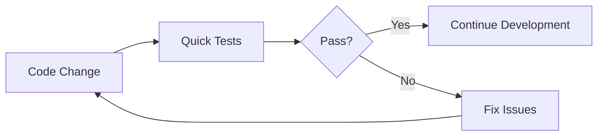
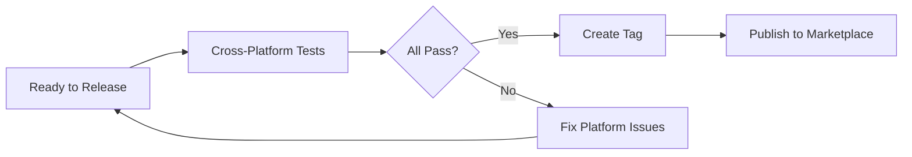

# Testing Strategy

This document explains the complete testing strategy for the Setup Salesforce CLI action.

## 🎯 Testing Philosophy

We use a **two-tier testing approach** to balance speed with comprehensive coverage:

1. **Quick Tests** (`test.yml`) - Fast feedback for development
2. **Cross-Platform Tests** (`test-cross-platform.yml`) - Comprehensive validation before releases

## 📊 Test Workflows Comparison

| Aspect               | Quick Tests          | Cross-Platform Tests           |
| -------------------- | -------------------- | ------------------------------ |
| **File**             | `test.yml`           | `test-cross-platform.yml`      |
| **When**             | Every push/PR        | PR to action.yml, tags, manual |
| **Duration**         | ~5-10 minutes        | ~20-30 minutes                 |
| **Platforms**        | Ubuntu only          | Ubuntu + Windows + macOS       |
| **Node Versions**    | Default (20)         | 18, 20                         |
| **Purpose**          | Development feedback | Release validation             |
| **Secrets Required** | Optional             | Optional (manual trigger)      |

## 🚀 Quick Tests (`test.yml`)

### Purpose

Provide **fast feedback** during development. These tests run on every push and PR to ensure basic functionality works.

### What It Tests

#### 1. Minimal Setup (Auth)

- Basic authentication
- CLI installation
- Output variables
- Org detection

#### 2. CLI Only (No Auth)

- CLI installation without authentication
- Works in any fork (no secrets needed)
- Validates action can be used for setup-only scenarios

#### 3. With Plugins

- sfdx-git-delta installation
- Code analyzer installation
- Strict mode behavior

#### 4. Dev Tools

- Prettier installation
- ESLint installation
- LWC Jest installation
- Tool version verification

#### 5. Custom Settings

- Custom org alias
- Node version selection
- CLI version specification

#### 6. Error Handling

- Missing required inputs
- Graceful failure behavior
- Error message quality

#### 7. Cache Behavior

- Cache creation
- Cache restoration
- Performance improvement verification

### When to Run

- ✅ Every push to `main` or `develop`
- ✅ Every pull request
- ✅ Manual dispatch for testing

### Secret Requirements

Most tests will **skip gracefully** if secrets are unavailable (e.g., in forks). Critical tests that don't need secrets will always run:

- CLI Only (No Auth)
- Error Handling
- Cache Behavior

## 🌍 Cross-Platform Tests (`test-cross-platform.yml`)

### Purpose

Ensure the action works **identically across all supported platforms** before releasing new versions.

### What It Tests

#### 1. CLI Installation (Matrix)

Tests basic CLI installation on:

- Ubuntu (latest)
- Windows (latest)
- macOS (latest)
- Node 18 and 20

**Total**: 6 combinations

#### 2. Full Setup with Tools (Matrix)

Tests complete setup with all optional tools on all platforms:

- All plugins (delta, scanner)
- All dev tools (prettier, eslint, jest)
- Strict mode

**Total**: 3 platforms

#### 3. Cache Performance

Tests caching behavior:

- First run (cache miss)
- Second run (cache hit)
- Platform-specific cache paths

**Total**: 6 runs (3 platforms × 2 runs)

#### 4. Authentication (Optional)

Tests authentication on all platforms (only runs with secrets):

- JWT authentication
- Org detection
- Output variables

**Total**: 3 platforms (when enabled)

#### 5. Error Handling (Matrix)

Tests error handling on all platforms:

- Missing inputs
- Invalid configurations
- Platform-specific error messages

**Total**: 3 platforms

### When to Run

- ✅ Pull requests that modify `action.yml`
- ✅ New version tags (`v*`)
- ✅ Manual dispatch (with optional auth tests)

### Platform Coverage

```
Ubuntu   ✅ Full coverage
Windows  ✅ Full coverage
macOS    ✅ Full coverage
```

## 🔄 Testing Workflow

### During Development



### Before Release



## 🧪 Running Tests Locally

### Quick Tests

```bash
# Install act (https://github.com/nektos/act)
brew install act  # macOS
# or
choco install act-cli  # Windows

# Run quick tests
act -j test-skip-auth  # This one doesn't need secrets

# Run with secrets (if available)
act -j test-minimal --secret-file .secrets
```

### Cross-Platform Tests

Cross-platform tests are best run in GitHub Actions, but you can test individual platforms:

```bash
# Test on current platform
act -j test-cli-install --matrix os:ubuntu-latest

# Note: Windows and macOS testing requires native runners
```

## 📋 Test Checklist for Contributors

Before submitting a PR:

- [ ] Run quick tests locally if possible
- [ ] Verify `test-skip-auth` passes (no secrets needed)
- [ ] Check that your changes don't break existing functionality
- [ ] Add new tests for new features
- [ ] Update documentation if behavior changes

Before releasing:

- [ ] All quick tests pass
- [ ] Cross-platform tests pass on all platforms
- [ ] Authentication tests pass (if secrets available)
- [ ] Cache tests show performance improvement
- [ ] Error handling tests pass

## 🐞 Debugging Test Failures

### Quick Test Failures

1. **Check the test logs** in GitHub Actions
2. **Look for the specific step** that failed
3. **Common issues**:
   - Missing secrets (tests should skip gracefully)
   - Authentication failures (check credentials)
   - Plugin installation errors (check network)
   - Tool installation errors (check package availability)

### Cross-Platform Test Failures

1. **Identify which platform(s) failed**
2. **Check platform-specific issues**:

   - Windows: PowerShell syntax, path issues
   - macOS: Homebrew availability, slower performance
   - Linux: Sudo access, package managers

3. **Common cross-platform issues**:
   - Shell script compatibility (use bash)
   - Path separators (use `/` even on Windows in bash)
   - Line endings (configure git properly)
   - Case sensitivity (macOS/Linux vs Windows)

## 🔧 Adding New Tests

### To Quick Tests

Add a new job to `test.yml`:

```yaml
test-new-feature:
  name: Test New Feature
  runs-on: ubuntu-latest

  steps:
    - uses: actions/checkout@v4

    - name: Setup with New Feature
      uses: ./
      with:
        # Your inputs

    - name: Verify New Feature
      run: |
        # Your verification
```

### To Cross-Platform Tests

Add a new job with matrix to `test-cross-platform.yml`:

```yaml
test-new-feature:
  name: Test New Feature - ${{ matrix.os }}
  runs-on: ${{ matrix.os }}
  strategy:
    matrix:
      os: [ubuntu-latest, windows-latest, macos-latest]

  steps:
    # Your test steps
```

## 📊 Test Metrics

We track these metrics:

### Quick Tests

- **Success Rate**: Should be >95%
- **Duration**: Target <10 minutes
- **Coverage**: Core functionality

### Cross-Platform Tests

- **Success Rate**: Should be 100% before release
- **Duration**: Target <30 minutes
- **Coverage**: All platforms, all features

## 🎯 Testing Best Practices

1. **Fail Fast**: Tests should fail quickly if something is wrong
2. **Clear Errors**: Error messages should explain what went wrong
3. **Idempotent**: Tests should be runnable multiple times
4. **Isolated**: Tests shouldn't depend on each other
5. **Documented**: Complex tests should have comments
6. **Maintained**: Update tests when features change

## 🔗 Related Documentation

- [Contributing Guide](CONTRIBUTING.md)
- [Platform Support](PLATFORM_SUPPORT.md)
- [Migration Guide](MIGRATION_V1_TO_V2.md)

---

**Questions about testing?** Open an issue or discussion!
